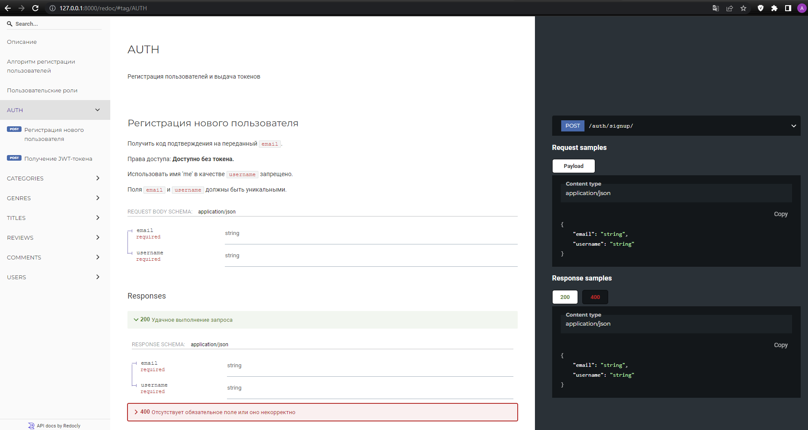

<h1 align="left">Проект YaMDb</h1>


## Общее описание:

Проект YaMDb собирает отзывы (Review) пользователей на произведения (Titles). 
Произведения делятся на категории: «Книги», «Фильмы», «Музыка». 
Список категорий (Category) может быть расширен администратором (например, можно добавить категорию «Изобразительное искусство» или «Ювелирка»).
Сами произведения в YaMDb не хранятся, здесь нельзя посмотреть фильм или послушать музыку.
В каждой категории есть произведения: книги, фильмы или музыка. 
Например, в категории «Книги» могут быть произведения «Винни-Пух и все-все-все» и «Марсианские хроники», а в категории «Музыка» — песня «Давеча» группы «Насекомые» и вторая сюита Баха. Произведению может быть присвоен жанр (Genre) из списка предустановленных (например, «Сказка», «Рок» или «Артхаус»). 
Новые жанры может создавать только администратор.
Благодарные или возмущённые пользователи оставляют к произведениям текстовые отзывы (Review) и ставят произведению оценку в диапазоне от одного до десяти (целое число); из пользовательских оценок формируется усреднённая оценка произведения — рейтинг (целое число). 
На одно произведение пользователь может оставить только один отзыв.

## Инструкция по запуску проекта:

1. Скачать образ с Docker Hub:
```
docker pull alexcodesxg/api_yamdb:v1.09.2022
```

2. Создать и заполнить .env файл (например):
```
SECRET_KEY=D0fb_u6kIilA5DgHUIBjB
DB_ENGINE=django.db.backends.postgresql
DB_NAME=postgres
POSTGRES_USER=postgres
POSTGRES_PASSWORD=test1
DB_HOST=db
DB_PORT=5432
```

3. Собрать контейнеры:
```
docker-compose up -d --build
```

4. Провести миграции:
```
docker-compose exec web python manage.py migrate
```

5. Собрать статику:
```
docker-compose exec web python manage.py collectstatic --no-input
```

6. Загрузить данных из фикстур:
```
docker-compose exec web python manage.py dumpdata > fixtures.json
```

7. Запустить проект по ссылке:
```
    http://localhost/
```

<h1 align="left">Краткое описание проекта Api Yamdb</h1>

## Техническая документация проекта:
```
http://127.0.0.1:8000/redoc/
```
 

## Регистрация:
```
http://127.0.0.1:8000/api/v1/auth/signup/
```

## Основные маршруты:
```
{
    "titles": "http://127.0.0.1:8000/api/v1/titles/",
    "genres": "http://127.0.0.1:8000/api/v1/genres/",
    "categories": "http://127.0.0.1:8000/api/v1/categories/"
}
```

## Используемый стек технологий API Yamdb:

- Python 3.7 (язык программирования)
- Django Rest Framework (Web Api)
- PostgreSQL (СУБД)
- Nginx (прокси-сервер)
- Docker (контейнеризация)
- ReDoc (документация)

## Авторы проекта:

- @Alex-code-sxg
- @jekyak
- @Maria-Volodina
